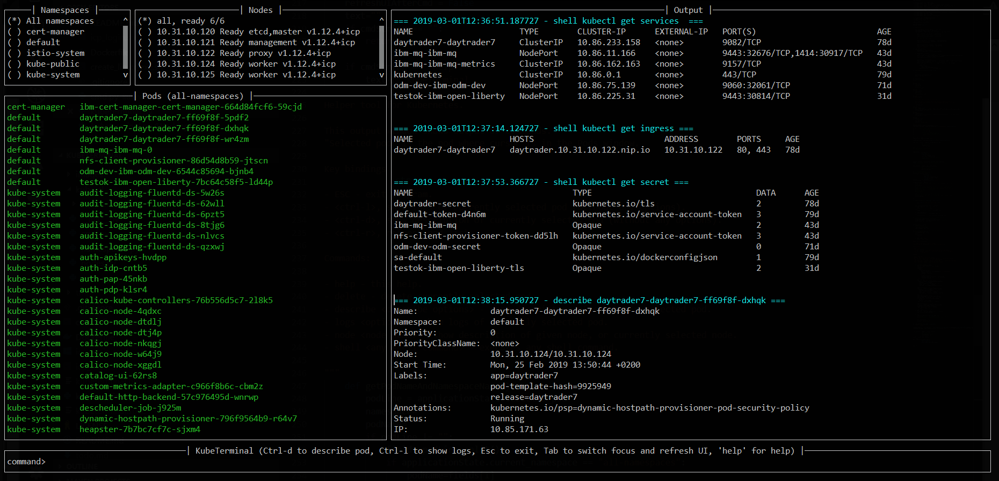
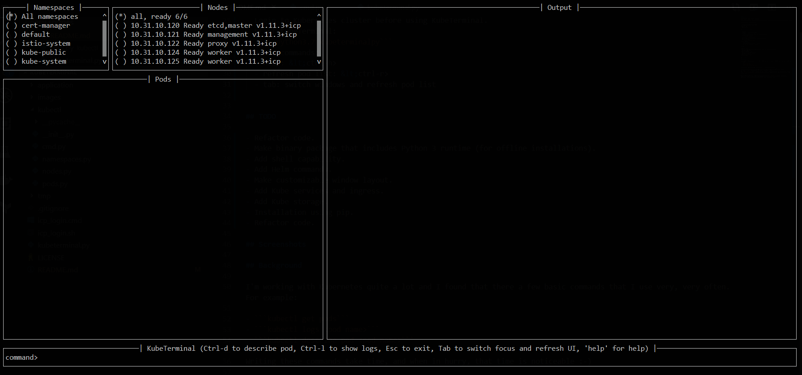
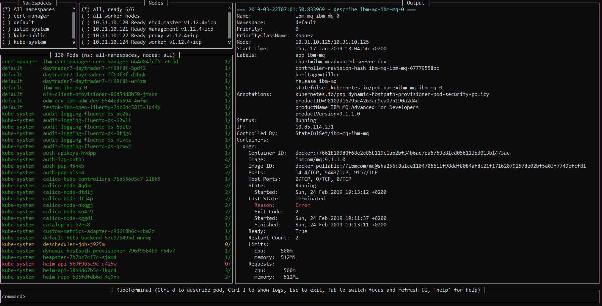
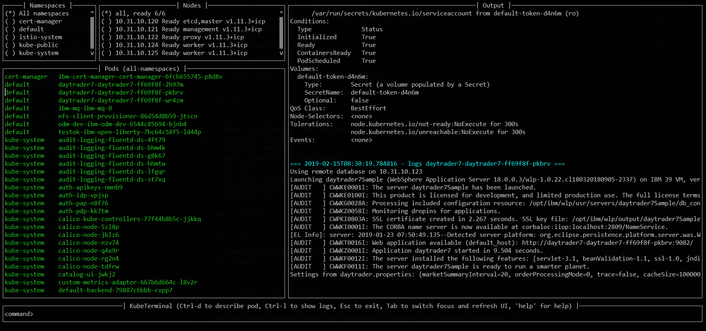

# KubeTerminal

KubeTerminal is helper tool for Kubernetes. The idea is provide a simple and quick tool to get the basics out of Kubernetes environment. 

KubeTerminal is complementing, not replacing, existing kubectl and shell.

Features include (and more planned):

- Uses the shell and kubectl-command.
- List pods in namespace and/or node.
- See pod logs.
- Describe pods.
- Option for single executable, for easy installation.
- Colors, if terminal supports them.



## Installation and usage

- Python 3.
  - Python 3.7.2 and 3.6.8 used for development.
  - Windows or Linux. 
    - [cmder console](http://cmder.net/) used in Windows 10.
- Clone/download this repo.
- Install prompt-toolkit:
  - ```pip3 install prompt-toolkit```
- Install and configure kubectl.
- Login to Kubernetes cluster before using KubeTerminal.
- Start KubeTerminal:
  - ```python3.7 kubeterminalpy```
- Basic commands:
  - help: &lt;ctrl-h>
  - refresh pod list: &lt;ctrl-r>  
  - tab: switch windows and refresh pod list
  - use tab to go to Pods-window and:
    - line up/down to select pod 
    - describe pod: &lt;ctrl-d>
    - show logs: &lt;ctrl-l>

## Executable binary

Executable binary is used to provide easy way to distribute KubeTerminal to servers without Internet connection.
[PyInstaller](https://www.pyinstaller.org) can be to create the executable

Binary is created on system where you want to use the binary. For Windows binary, create the binary in Windows, for Linux, create the binary in Linux, and so on.

### Docker

DockerHub has image *kazhar/kubeterminal* and it includes Linux executable:

Use following commands to copy the executable to local machine:

```
docker create -it --name kubeterminal kazhar/kubeterminal bash
docker cp kubeterminal:/root/dist/kubeterminal kubeterminal.bin
docker rm -fv kubeterminal
```

### Create binary

Use the following commands create binary in the platform you are using:

- Install PyInstaller
  - ```pip install pyinstaller```
- Create single file executable:
  - ```pyinstaller --onefile kubeterminal.py```
- Binary file is located:
  - ```dist/kubeterminal```
  - if building on Windows, file has *.exe* suffix.

Or, to create Linux executable using Docker:
- Execute script:
  - ```create_linux_exe.sh```
- The executable is copied current directory.
- Executable name:
  - ```kubeterminal.bin```


## TODO

Some, but not all, things to do:

- Refactor code.
- ~~Make binary package that includes Python 3 runtime (for offline installations).~~
- Add shell capability.
- Add Helm commands.
- Make customizable window layout.
- Add Kube services and ingress.
- Add Kube storage. 
- Installation using pip.
- Version info.
- Refactor code.

## Screenshots









## Background

I'm working with Kubernetes quite a lot and I found that there a few basic commands that I use very, very often. For example:

- ```kubectl get pods```
- ```kubectl logs <pod name>```
- ```kubectl describe pod <pod name>```

Writing these commands take time, and when in hurry, that time is noticeable. 

I accidentally found [Kubebox](https://github.com/astefanutti/kubebox) and immediately tried it. 
But authentication failed when using IBM Cloud Private and self-signed certificate.

BTW, [IBM Cloud Private](https://www.ibm.com/cloud/private) is the main Kubernetes environment that I'm using ([there's free Community Edition available at Docker Hub](https://hub.docker.com/r/ibmcom/icp-inception/), you should try it :-).

Kubebox idea haunted until I remembered the existence of [Python Prompt Toolkit](https://github.com/prompt-toolkit/python-prompt-toolkit) and remembered that it can be used to create full-screen terminal application. 

I decided to make my own Kubebox, and I named it KubeTerminal :-)
